# BRKN Lifestyle Prompt Composer Explainer

This visual explainer shows the V1 mental model:

```text
Choose packs -> build a prompt pool -> randomize with locks and seed -> generate final prompt
```

The browser is the visual pack selector. The composer is the prompt engine. Packs define available prompt pools, not LoRAs or final prompts.

## Slides

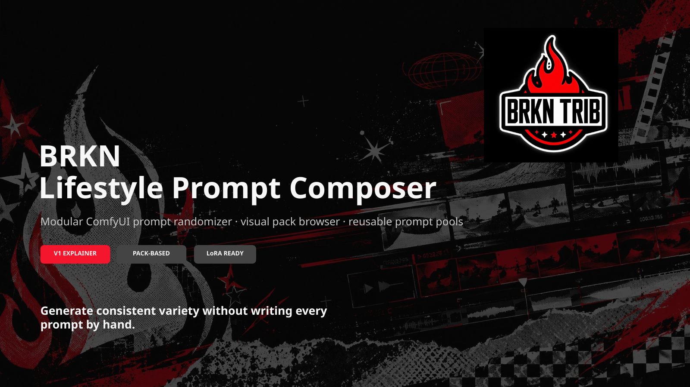

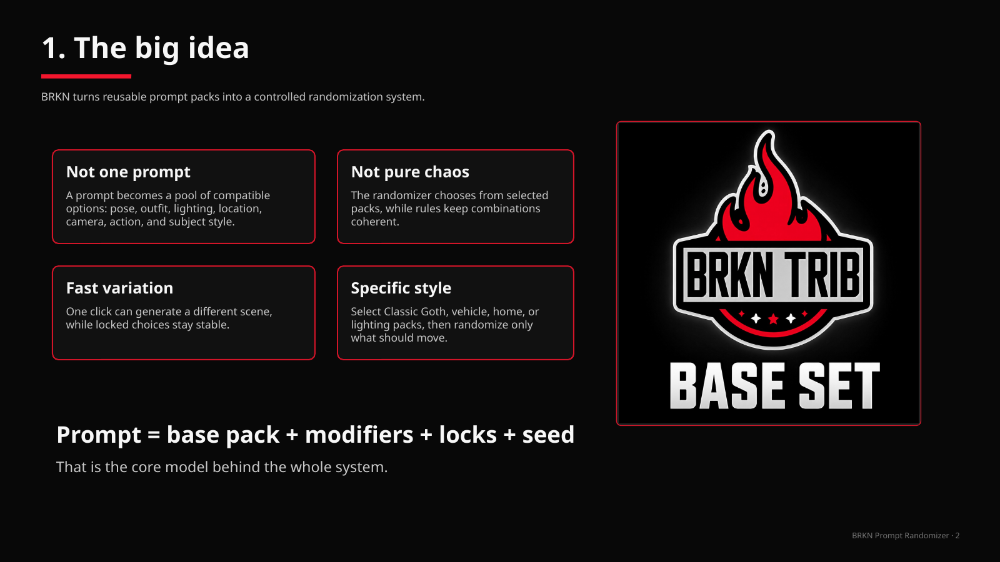

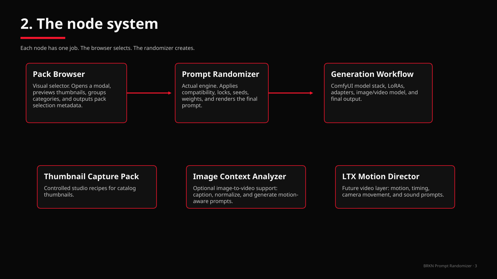

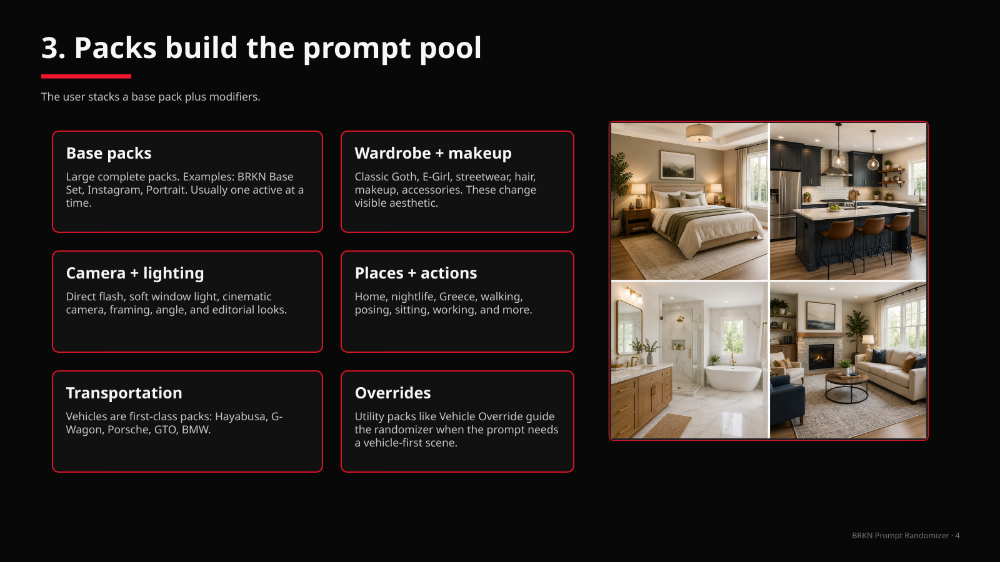

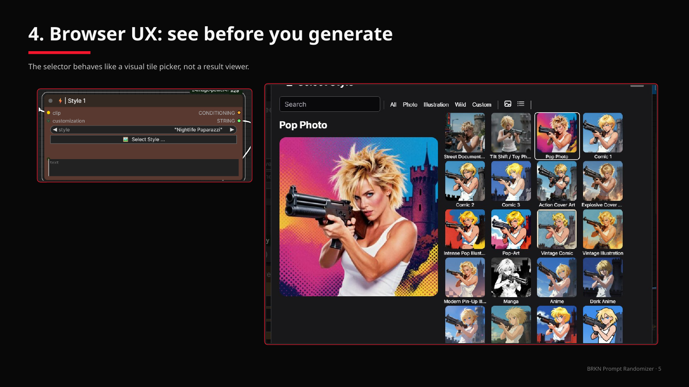

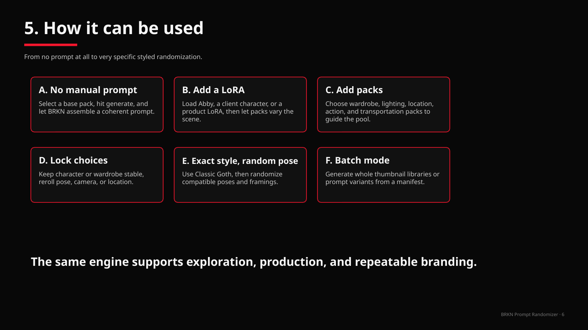

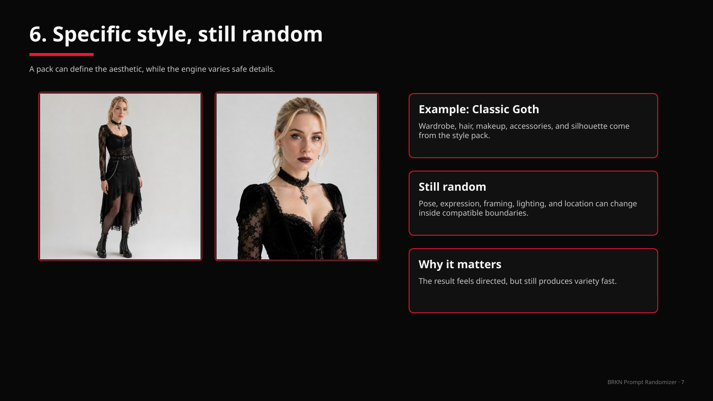

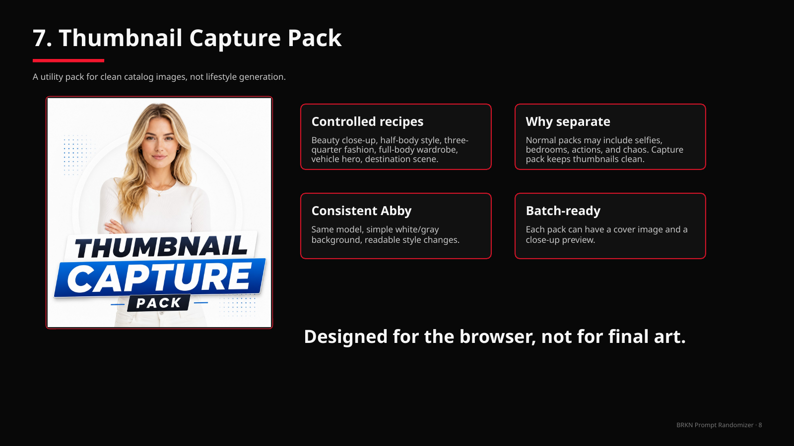

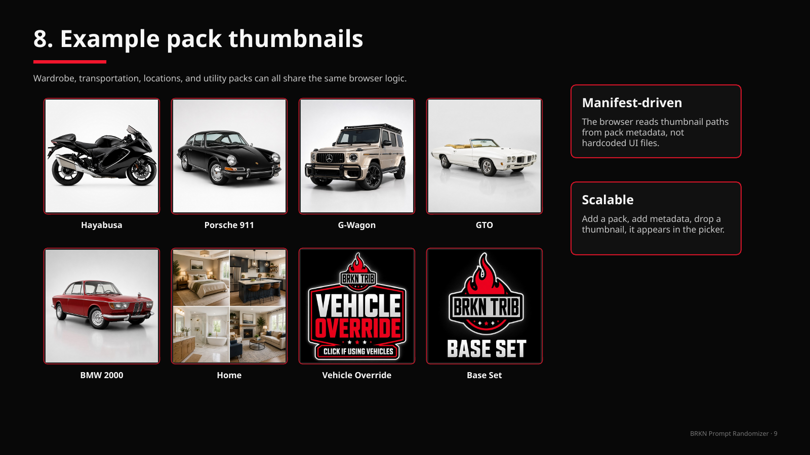

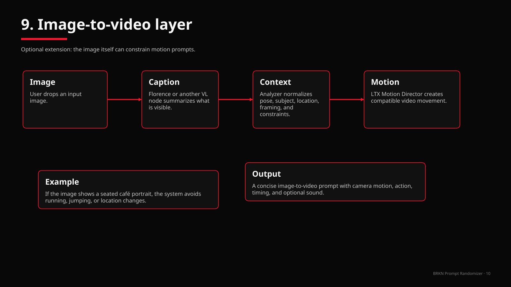

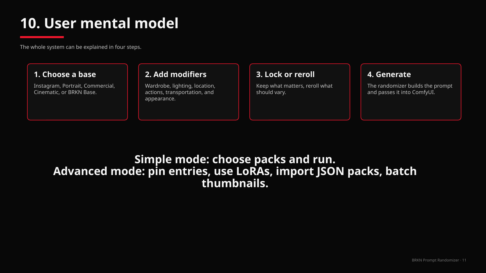

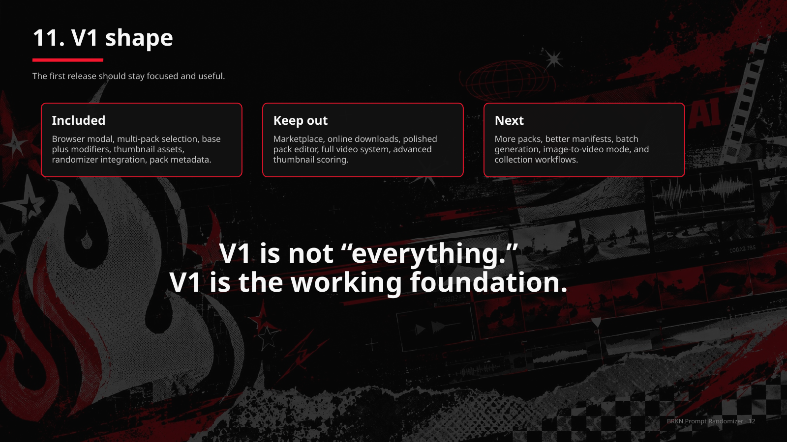
